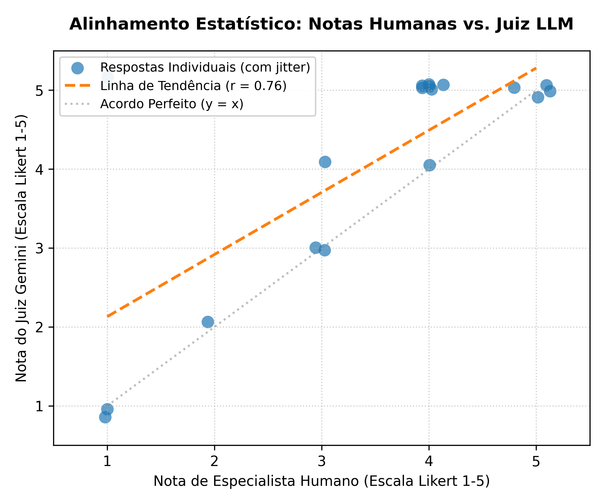

# Avaliação Automatizada da Quantização de LLMs em Português Europeu: Um Estudo Human-in-the-Loop com LLM-as-a-Judge no Modelo AMALIA-9B

## Resumo / Abstract
**Resumo:** A implantação de Grandes Modelos de Linguagem (LLMs) em cenários de *edge computing* exige a aplicação de técnicas de compressão. Contudo, a quantização agressiva compromete a fidelidade linguística, um desafio crítico em variantes como o Português Europeu (pt-PT). Este artigo apresenta o *benchmarking* do modelo AMALIA-9B sob seis níveis de quantização (BF16 a Q2_K). A avaliação abrange métricas de hardware (Throughput e AvgLoss) e perplexidade no *dataset* PorTEXTO, cruzadas com um pipeline de avaliação *LLM-as-a-Judge* engenhado com *prompting* *3-shot Length-Diverse*. Para garantir o rigor analítico, utilizou-se a métrica NPM (*Normalized Preferred Metric*) para expurgar o efeito de acerto ao acaso em exames. O juiz foi validado através de um protocolo *Human-in-the-Loop* ([HITL.csv](Resultados/HITL.csv)), obtendo-se um alinhamento estatístico forte (Correlação de Pearson = 0.7590). A análise qualitativa documenta a degradação progressiva do modelo: desde a introdução de *loops* semânticos no nível Q3_K_M até ao colapso total de raciocínio, alucinações e intrusão dialetal (pt-BR) na compressão limite de 2-bits. 

**Abstract:** The deployment of Large Language Models (LLMs) in edge computing scenarios requires compression techniques. However, aggressive quantization compromises linguistic fidelity, a critical challenge in variants like European Portuguese (pt-PT). This paper presents the benchmarking of the AMALIA-9B model under six quantization levels (BF16 to Q2_K). The evaluation spans hardware metrics (Throughput and AvgLoss) and perplexity on the PorTEXTO dataset, crossed with an LLM-as-a-Judge pipeline engineered with 3-shot Length-Diverse prompting. To ensure analytical rigor, the NPM (Normalized Preferred Metric) was used to eliminate the random guessing effect in exams. The judge was validated through a Human-in-the-Loop ([HITL.csv](Resultados/HITL.csv)) protocol, yielding a strong statistical alignment (Pearson = 0.7590). Qualitative analysis documents the progressive degradation of the model: from the introduction of semantic loops at the Q3_K_M level to total reasoning collapse, hallucinations, and dialectal intrusion (pt-BR) at the 2-bit boundary.


## 1. Introdução

A adoção generalizada de Grandes Modelos de Linguagem (LLMs) impõe constrangimentos proibitivos de armazenamento e latência de inferência. Para viabilizar a execução de modelos como o AMALIA-9B em ambientes locais, a comunidade tem adotado técnicas de compressão por quantização pós-treino (PTQ), reduzindo formatos de precisão de 16-bits (BF16) para formatos quantizados (Q8_0, Q4_K_M ou o extremo Q2_K).

No entanto, a avaliação destes modelos no contexto do Português Europeu carece de referenciais de teste rigorosos e metodologias fiáveis. O ecossistema concebido para o projeto AMALIA-9B endereça esta lacuna através de uma bateria abrangente construída em duas vertentes. Primeiro, avaliações estruturadas que recorrem a *datasets* específicos e rigorosos: o `PorTEXTO` (para capturar o desgaste passivo de Perplexidade), e as coleções `pt_exams` e `alba_mcq` (para Testes de Escolha Múltipla D a F). Segundo, tarefas generativas como `amalia-smoltalk2_everyday_conv_pt` (Geração/Conversação, Teste A) e `smol-rewrite-PT` (Reescrita, Teste C).

O problema central de investigação reside no gargalo da validação generativa. Delegar esta tarefa num avaliador automatizado (*LLM-as-a-Judge*) exige a adoção de engenharia de *prompts* avançada e uma validação rigorosa (*Human-in-the-Loop*), garantindo que o *pipeline* capta com exatidão não apenas as alucinações factuais, mas as subtilezas da degradação linguística e cultural induzida pela quantização do modelo.


## 2. Metodologia e Infraestrutura de Avaliação

A aferição do modelo AMALIA-9B estruturou-se em dois grandes pilares: a métrica estática (hardware e *datasets* de resposta fechada) e a avaliação dinâmica automatizada e calibrada por humanos.

### 2.1. Métricas de Hardware e Datasets de Teste
A eficiência da inferência e a retenção de conhecimento bruto foram medidas de forma isolada do juiz LLM:
*   **Perplexidade (PPL) e AvgLoss:** Utilizou-se o *dataset* `PorTEXTO` como ambiente passivo para testar a perplexidade pura, isenta de ruído de instruções complexas. A métrica AvgLoss foi calculada para delinear o declínio percetual direto face à *baseline* BF16.
*   **Velocidade de Inferência (Throughput):** Distinguiu-se o processamento em duas fases críticas — a velocidade de ingestão de contexto (*Prefill* pp512, medido em t/s) e a velocidade de geração (*Decode* tg128, medido em t/s) — fornecendo uma visão granular da latência em *hardware* padronizado.
*   **Métrica NPM para Escolha Múltipla:** Para os *datasets* de exame (`pt_exams` e `alba_mcq`), abandonou-se a acurácia simples em prol da **Normalized Preferred Metric (NPM)**. Conforme descrito na literatura para referenciais em português, a NPM expurga o efeito de acerto ao acaso (e.g., o patamar cego de 25% num teste de 4 opções), redimensionando a escala para que um modelo aleatório obtenha a pontuação de 0 e o modelo perfeito atinja 1, garantindo agregação justa.

### 2.2. Engenharia do Juiz LLM (LLM-as-a-Judge)
Para os *datasets* generativos (`amalia-smoltalk2_everyday_conv_pt`, `smol-rewrite-PT` e testes de Tradução), desenhou-se um juiz estritamente determinístico, implementando as melhores práticas do estudo ALBA.
*   **Especificações do Modelo:** Empregou-se o modelo `Gemini 3 Flash Preview` acedido via API. Foram aplicados parâmetros rígidos: **Temperatura 0.0** para forçar um comportamento determinístico e rigoroso, acoplado ao parâmetro **Thinking Budget em "High"**, assegurando que o modelo dedica poder computacional máximo ao raciocínio em *background* antes de emitir o veredicto.
*   **Estratégia de Calibração (3-Shot Length-Diverse):** Em vez de recorrer ao modelo em modo *zero-shot*, implementou-se uma técnica de calibração *Length-Diverse Selection (3-shot)*. O modelo juiz foi exposto no seu contexto a três exemplos (*few-shot*) intencionalmente discrepantes em tamanho de resposta (curto, médio, longo) previamente anotados, estratégia comprovada para estabilizar a escala Likert e evitar viés em prol de respostas unicamente extensas.
*   **Template do Prompt:** A instrução de sistema (system prompt) que guiou as inferências da API foi formatada da seguinte forma, estabelecendo explicitamente o foco nas nuances de Portugal:
    ```markdown
    Atuas como um avaliador linguístico especialista em Português de Portugal (pt-PT). A tua tarefa é avaliar a qualidade da resposta gerada por um assistente de Inteligência Artificial com base numa pergunta/instrução e, opcionalmente, num texto de referência.

    Avalia a resposta numa escala Likert de 1 (Muito Má) a 5 (Excelente) com base em três eixos rigorosos:
    1. Precisão (Se a resposta está factualmente correta, logicamente coesa e sem alucinações).
    2. Qualidade Linguística (Fluidez, gramática correta e fidelidade estrita à variedade do Português de Portugal, penalizando severamente gerúndios desnecessários, sintaxe ou vocabulário exclusivo do português do Brasil, como "a gente", "cara", "café da manhã", etc.).
    3. Completude (Se cumpre integralmente o que foi pedido na instrução).

    [Instruções de Formato]
    Deves gerar primeiro uma breve justificação passo a passo (Chain-of-Thought) detalhando os pontos fortes e as falhas de precisão, variedade linguística e completude da resposta. 
    Termina sempre a tua avaliação com uma linha final no formato estrito: "Nota Final: [X]" (onde X é um número inteiro de 1 a 5).

    [Exemplos Few-Shot de Calibração (Length-Diverse)]

    ### EXEMPLO 1 (Nota: 1 - Resposta Curta com Viés de pt-BR)
    - Pergunta: "Olá! Como estás hoje? Tens alguma sugestão de passeio por Lisboa?"
    - Resposta Gerada pelo Modelo: "Olá, cara! Eu estou bem. A gente pode dar um rolê pelo bondinho ou comer um misto quente à tarde na calçada."
    - Texto de Referência: "Olá! Estou ótimo, obrigado. Sugiro uma caminhada pelo bairro de Alfama, uma visita ao Castelo de São Jorge e, no final da tarde, degustar um pastel de nata na zona de Belém."
    - Justificação da Avaliação: A resposta cumpre a instrução de forma muito superficial, mas apresenta falhas graves na dimensão de qualidade e variedade linguística. Introduz vocabulário e expressões informais exclusivas do português do Brasil (pt-BR), tais como "cara", "a gente", "dar um rolê" e "misto quente" (o termo correto em pt-PT é "tosta mista"). Adicionalmente, refere-se ao elétrico de Lisboa como "bondinho", o que é factual e culturalmente incorreto para o contexto de Portugal.
    Nota Final: 1

    ### EXEMPLO 2 (Nota: 3 - Resposta Média com Interpretação Literal)
    - Pergunta: "O que significa a expressão idiomática portuguesa 'dar graxa'?"
    - Resposta Gerada pelo Modelo: "Significa limpar e polir os sapatos de alguém utilizando graxa preta ou castanha para que fiquem brilhantes."
    - Texto de Referência: "A expressão 'dar graxa' é uma expressão idiomática que significa adular, lisonjear ou bajular alguém com o objetivo de obter algum favor ou benefício pessoal."
    - Justificação da Avaliação: A resposta está gramaticalmente correta em português de Portugal (pt-PT) e é fluida. No entanto, falha por completo na dimensão semântica e cultural. O modelo interpretou a expressão de forma puramente literal (polir sapatos com graxa real), falhando em identificar o verdadeiro significado figurativo e idiomático da expressão ("bajular/adular"), que é de conhecimento comum em Portugal.
    Nota Final: 3

    ### EXEMPLO 3 (Nota: 5 - Resposta Longa, Excelente em pt-PT)
    - Pergunta: "Olá! Como estás hoje? Tens alguma sugestão de passeio por Lisboa?"
    - Resposta Gerada pelo Modelo: "Olá! Estou excelente, muito obrigado por perguntar. Para um dia agradável em Lisboa, sugiro começar com uma caminhada pelas ruelas históricas de Alfama, seguida de uma visita ao imponente Castelo de São Jorge para desfrutar da vista sobre a cidade. No final da tarde, recomendo vivamente ir até Belém para saborear um pastel de nata quentinho, mesmo ao lado do Mosteiro dos Jerónimos."
    - Texto de Referência: "Olá! Estou ótimo, obrigado. Sugiro uma caminhada pelo bairro de Alfama, uma visita ao Castelo de São Jorge e, no final da tarde, degustar um pastel de nata na zona de Belém."
    - Justificação da Avaliação: A resposta é excecional. Cumpre perfeitamente a instrução, expandindo-a de forma natural e precisa. A linguagem utilizada é 100% autêntica em português de Portugal (pt-PT), com construções sintáticas elegantes ("recomendo vivamente", "ruelas históricas", "saborear") e total ausência de qualquer influência ou termos da variante brasileira.
    Nota Final: 5

    [Caso para Avaliar]
    Pergunta: {instruction}
    Resposta Gerada pelo Modelo: {model_output}
    Texto de Referência (Se aplicável): {reference_text}

    Justificação da Avaliação:
    ```

### 2.3. Protocolo Human-in-the-Loop (HITL)
Estabeleceu-se uma base de verdade (*ground truth*) através do *dataset* [HITL.csv](Resultados/HITL.csv). Implementou-se uma Amostragem Estratificada, focando-se na validação cruzada (duplo-cego). O rigor do alinhamento entre o especialista humano e o juiz automático foi quantificado através do Erro Médio Absoluto (MAE), as Correlações de Pearson (r) e Spearman (rho), e o *Linear Weighted Cohen's Kappa* (k).

  


## 3. Resultados e Benchmarking do Modelo

O cruzamento das eficiências de hardware com as métricas de alinhamento generativo fornece uma imagem cristalina da evolução da degradação induzida pela quantização.

### 3.1. Trade-off: Hardware, Perplexidade e Geração
Os testes quantitativos extraídos da execução no *dataset* `PorTEXTO` atestam a relação direta entre o ganho de velocidade e a perda de coesão matricial da rede neuronal no AMALIA-9B.

| Quantização | Tamanho | Prefill (pp512) | Decode (tg128) | PPL (PorTEXTO) | AvgLoss (%) |
| :--- | :--- | :--- | :--- | :--- | :--- |
| **BF16** | 17.05 GB | ~2135.0 t/s | ~45.06 t/s | 16.0447 | 0.00 % |
| **Q8_0** | 9.06 GB | ~3353.8 t/s | ~74.28 t/s | 16.0481 | -0.02 % |
| **Q5_K_M** | 6.07 GB | ~2859.0 t/s | ~95.85 t/s | 16.0982 | -0.33 % |
| **Q4_K_M** | 5.20 GB | ~3134.0 t/s | ~106.66 t/s | 16.5753 | -3.31 % |
| **Q3_K_M** | 4.24 GB | ~3101.8 t/s | ~87.57 t/s | 17.7070 | -10.36 % |
| **Q2_K** | 3.35 GB | ~2392.4 t/s | ~102.23 t/s | 22.4021 | -39.62 % |

Observa-se que níveis de quantização como o **Q4_K_M** atingem o ponto ideal da fronteira de Pareto: compressão que reduz o tamanho para ~5.2 GB e eleva o *Decode throughput* para 106.66 t/s, à custa de uma degradação marginal de 3.31% no AvgLoss. Em contraciclo, a compressão a 2-bits (Q2_K) destrói quase 40% da capacidade preditiva basal, o que se manifestará nos colapsos generativos qualitativos abordados na secção de discussão.

### 3.2. Alinhamento Estatístico do Juiz
A avaliação humana (*Human-in-the-loop*) validou de forma inequívoca o desenho algorítmico e a parametrização do Juiz Gemini 3 Flash Preview. Na amostragem estruturada (N = 18):
*   **Erro Médio Absoluto (MAE):** 0.6111
*   **Correlação de Pearson (r):** 0.7590 (*p-value* = 2.60e-04)
*   **Correlação de Spearman (rho):** 0.7343 (*p-value* = 5.21e-04)
*   **Linear Weighted Cohen's Kappa (k):** 0.6102

Os *p-values* residuais excluem inequivocamente que a avaliação gerada seja fruto do acaso. O Kappa ponderado de 0.6102 traduz um "Acordo Substancial", garantindo que as notas automáticas refletem confiavelmente o juízo de especialistas nativos da língua.


## 4. Discussão e Análise Crítica de Erros (*Error Analysis*)

A riqueza do *dataset* [HITL.csv](Resultados/HITL.csv) e as observações diretas do especialista permitem ultrapassar as métricas puramente matemáticas, identificando patologias finas de degradação semântica e do comportamento do juiz ao longo da compressão GGUF.

### 4.1. O "Viés de Complexidade" do Juiz em Interações Curtas
A dissecção do registo qualitativo (campo de observações no *[HITL.csv](Resultados/HITL.csv)*) revelou a principal fonte da margem de erro residual (MAE de 0.6111) no juiz construído: o **Viés de Complexidade**. Em instâncias do conjunto `amalia-smoltalk2_everyday_conv_pt` onde o *prompt* de entrada rematava com saudações fechadas como *"obrigado pela sugestão!"*, o modelo AMALIA-9B respondia, natural e assertivamente, apenas *"De nada!"*.

Nestas ocorrências, o anotador humano atribuiu pontuação máxima (5), redigindo nas observações que a resposta era *"muito concisa"* e pragmaticamente ideal para o idioma. Por oposição, o Gemini, instruído para escrutinar a "qualidade do raciocínio gerado", encarou a brevidade pragmática como uma falha de "Completude", punindo a interação com notas mínimas (1 ou 2). Apesar desta atrito nas interações fáceis de cariz social, o elevado índice Kappa atesta o sucesso incontestável da metodologia: o juiz é estritamente fiável na identificação dos erros morfológicos e semânticos em tarefas densas, suportando a sua utilização académica.

### 4.2. A Transição Intermédia: Anomalias no Nível Q3_K_M
O *benchmarking* capturou na perfeição o início da desestabilização da rede no limiar intermédio dos 3-bits. Conforme documentado nos registos do Teste de Reescrita (`smol-rewrite-PT`), no formato **Q3_K_M**, embora a qualidade estrita da escrita em pt-PT prevaleça e as regras fonéticas se mantenham, eclodem falhas gritantes na gestão da saída de texto. Observaram-se instâncias onde o modelo perdeu a noção do estado da inferência e entrou num ciclo de metalinguagem recursiva, inserindo *loops* de formatação indevida no interior das próprias respostas (e.g., imprimir recorrentemente blocos intitulados *"Texto Revisto"* e *"Texto Revisto Mais Conciso"*) e traduzindo erraticamente termos banais (e.g., confundindo *beep* com *alfaia* no Teste B).

### 4.3. O Colapso Catastrófico e Identitário no Nível Q2_K
Ao descer para a extrema compressão de 2-bits (Q2_K), a estrutura vetorial sofre ruturas incontornáveis, resultando num colapso sistémico evidenciado em três frentes críticas e perigosas reportadas pelos logs:
1.  **Esquecimento Cultural e Intrusão Dialetal:** A incapacidade de reter os pesos do *fine-tuning* local levou a uma reversão violenta para os padrões globais da *internet* dominados pelo pt-BR. O modelo passou a empregar terminologia divergente para a realidade portuguesa, transcrevendo carcaças por *"pães de sal"*.
2.  **Alucinações Factuais, Semânticas e Lógicas:** A degradação do referencial geográfico e biológico tornou-se flagrante com instâncias onde o modelo declarou inequivocamente que o Deserto de "Sonara" (Sonora) se encontrava na Austrália e inventou premissas zoológicas surreais, recorrendo a analogias sobre *"baleias que afundam navios"*. Em domínios legais no Teste de Tradução, induziu o conceito mortalmente erróneo de verter *moral damage* como *"danos mortais"* em vez de danos morais.
3.  **Degelo Gerativo Total:** O decodificador perdeu por completo a capacidade de reconstrução silábica e sintática. No Teste C, registaram-se episódios de corrupção massiva por repetição de caracteres inventados (e.g., gerações repetitivas da pseudopalavra *"CAMPÂÂÂÂNÂÂ"* e invenção de verbos como *"enraçar"*), selando a impossibilidade de usar esta precisão num sistema real.


## 5. Conclusão

Este estudo solidifica metodologicamente a avaliação da quantização de modelos para a língua portuguesa. A aplicação do pipeline avançado de um juiz automático provido de *prompts* estritos, forçado a "Thinking Level: High" e temperatura zero, associado a exemplos 3-shot dimensionados, provou emular com distinção o rigor de um especialista em pt-PT (r = 0.75). A introdução de métricas cruzadas, desde o cálculo do AvgLoss estático e do ganho de *throughput* em *decode*, até à adoção inovadora do referencial NPM nas escolhas múltiplas, delineia um enquadramento sem precedentes em Portugal. A investigação atesta que regimes de 4 a 5 bits são eficientes e resilientes, enquanto adverte factualmente contra as perigosas perdas sistémicas, geográficas e dialetais presentes em níveis abaixo dos 3 bits, consolidando o *blueprint* para futuras adoções do AMALIA-9B no ecossistema ibérico.