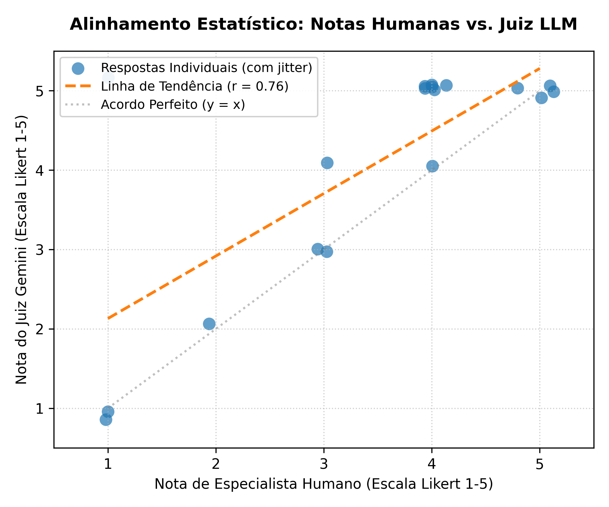

# Automated Evaluation of LLM Quantization in European Portuguese: A Human-in-the-Loop Study with LLM-as-a-Judge on the AMALIA-9B Model

## Summary / Abstract
**Summary:** The deployment of Large Language Models (LLMs) in edge computing scenarios requires compression techniques. However, aggressive quantization compromises linguistic fidelity, a critical challenge in variants like European Portuguese (pt-PT). This paper presents the benchmarking of the AMALIA-9B model under six quantization levels (BF16 to Q2_K). The evaluation spans hardware metrics (Throughput and AvgLoss) and perplexity on the PorTEXTO dataset, crossed with an LLM-as-a-Judge evaluation pipeline engineered with 3-shot Length-Diverse prompting. To ensure analytical rigor, the NPM (Normalized Preferred Metric) was used to eliminate the random guessing effect in exams. The judge was validated through a Human-in-the-Loop ([HITL.csv](Resultados/HITL.csv)) protocol, yielding a strong statistical alignment (Pearson Correlation = 0.7590). Qualitative analysis documents the progressive degradation of the model: from the introduction of semantic loops at the Q3_K_M level to total reasoning collapse, hallucinations, and dialectal intrusion (pt-BR) at the 2-bit boundary.


## 1. Introduction

The widespread adoption of Large Language Models (LLMs) imposes prohibitive constraints on storage and inference latency. To enable the execution of models like AMALIA-9B in local environments, the community has adopted post-training quantization (PTQ) compression techniques, reducing precision formats from 16-bits (BF16) to quantized formats (Q8_0, Q4_K_M, or the extreme Q2_K).

However, the evaluation of these models in the context of European Portuguese lacks rigorous testing benchmarks and reliable methodologies. The ecosystem designed for the AMALIA-9B project addresses this gap through a comprehensive battery built on two fronts. First, structured evaluations that rely on specific and rigorous datasets: `PorTEXTO` (to capture passive perplexity degradation), and the collections `pt_exams` and `alba_mcq` (for Multiple Choice Tests D to F). Second, generative tasks such as `amalia-smoltalk2_everyday_conv_pt` (Generation/Conversation, Test A) and `smol-rewrite-PT` (Rewriting, Test C).

The central research problem lies in the bottleneck of generative validation. Delegating this task to an automated evaluator (LLM-as-a-Judge) requires the adoption of advanced prompt engineering and rigorous validation (Human-in-the-Loop), ensuring that the pipeline captures with precision not only factual hallucinations but the subtleties of linguistic and cultural degradation induced by model quantization.


## 2. Methodology and Evaluation Infrastructure

The benchmarking of the AMALIA-9B model was structured around two major pillars: static metrics (hardware and closed-response datasets) and dynamic evaluation automated and calibrated by humans.

### 2.1. Hardware Metrics and Test Datasets
Inference efficiency and raw knowledge retention were measured in isolation from the LLM judge:
*   **Perplexity (PPL) and AvgLoss:** The `PorTEXTO` dataset was used as a passive environment to test pure perplexity, free from noise of complex instructions. The AvgLoss metric was calculated to outline the direct perceptual decline compared to the BF16 baseline.
*   **Inference Speed (Throughput):** Processing was distinguished in two critical phases — context ingestion speed (*Prefill* pp512, measured in t/s) and generation speed (*Decode* tg128, measured in t/s) — providing granular insight into latency on standardized hardware.
*   **NPM Metric for Multiple Choice:** For exam datasets (`pt_exams` and `alba_mcq`), simple accuracy was abandoned in favor of the **Normalized Preferred Metric (NPM)**. As described in the literature for Portuguese benchmarks, NPM eliminates the random guessing effect (e.g., the blind threshold of 25% in a 4-option test), rescaling the scale so that a random model obtains a score of 0 and a perfect model reaches 1, ensuring fair aggregation.

### 2.2. LLM Judge Engineering (LLM-as-a-Judge)
For generative datasets (`amalia-smoltalk2_everyday_conv_pt`, `smol-rewrite-PT`, and translation tests), a strictly deterministic judge was designed, implementing best practices from the ALBA study.
*   **Model Specifications:** The `Gemini 3 Flash Preview` model was employed via API access. Rigid parameters were applied: **Temperature 0.0** to enforce deterministic and rigorous behavior, coupled with the **Thinking Budget set to "High"**, ensuring the model dedicates maximum computational power to background reasoning before issuing the verdict.
*   **Calibration Strategy (3-Shot Length-Diverse):** Instead of resorting to zero-shot mode, a Length-Diverse Selection (3-shot) calibration technique was implemented. The judge model was exposed in its context to three examples (few-shot) intentionally discrepant in response size (short, medium, long) previously annotated—a strategy proven to stabilize the Likert scale and avoid bias toward solely extensive responses.
*   **Prompt Template:** The system instruction that guided API inferences was formatted as follows, explicitly establishing focus on Portuguese nuances:
    ```markdown
    You act as a linguistic evaluator expert in European Portuguese (pt-PT). Your task is to evaluate the quality of a response generated by an Artificial Intelligence assistant based on a question/instruction and, optionally, a reference text.

    Evaluate the response on a Likert scale from 1 (Very Poor) to 5 (Excellent) based on three rigorous axes:
    1. Accuracy (Whether the response is factually correct, logically coherent, and free of hallucinations).
    2. Linguistic Quality (Fluency, correct grammar, and strict fidelity to the European Portuguese variety, severely penalizing unnecessary gerunds, syntax or vocabulary exclusive to Brazilian Portuguese, such as "a gente", "cara", "café da manhã", etc.).
    3. Completeness (Whether it fully fulfills what was asked in the instruction).

    [Format Instructions]
    You should first generate a brief step-by-step justification (Chain-of-Thought) detailing the strengths and failures in accuracy, linguistic variety, and completeness of the response.
    Always end your evaluation with a final line in strict format: "Final Score: [X]" (where X is an integer from 1 to 5).

    [Few-Shot Calibration Examples (Length-Diverse)]

    ### EXAMPLE 1 (Score: 1 - Short Response with pt-BR Bias)
    - Question: "Hello! How are you today? Do you have any suggestions for sightseeing in Lisbon?"
    - Response Generated by Model: "Hi, buddy! I'm doing well. We can take a ride on the tram or eat a toasted sandwich in the afternoon on the sidewalk."
    - Reference Text: "Hello! I'm great, thank you. I suggest a walk through the Alfama neighborhood, a visit to São Jorge Castle and, in the late afternoon, enjoying a pastel de nata in the Belém area."
    - Evaluation Justification: The response fulfills the instruction in a very superficial way, but presents serious failures in the dimension of quality and linguistic variety. It introduces vocabulary and informal expressions exclusive to Brazilian Portuguese (pt-BR), such as "cara", "a gente", "dar um rolê", and "misto quente" (the correct term in pt-PT is "tosta mista"). Additionally, it refers to Lisbon's tram as "bondinho", which is factually and culturally incorrect for the Portuguese context.
    Final Score: 1

    ### EXAMPLE 2 (Score: 3 - Medium Response with Literal Interpretation)
    - Question: "What does the Portuguese idiomatic expression 'dar graxa' mean?"
    - Response Generated by Model: "It means to clean and polish someone's shoes using black or brown grease so they shine brightly."
    - Reference Text: "The expression 'dar graxa' is an idiomatic expression that means to flatter, praise, or butter up someone with the aim of obtaining some favor or personal benefit."
    - Evaluation Justification: The response is grammatically correct in European Portuguese (pt-PT) and is fluent. However, it fails completely in the semantic and cultural dimension. The model interpreted the expression in a purely literal way (polishing shoes with real grease), failing to identify the true figurative and idiomatic meaning of the expression ("flattering/praising"), which is common knowledge in Portugal.
    Final Score: 3

    ### EXAMPLE 3 (Score: 5 - Long Response, Excellent in pt-PT)
    - Question: "Hello! How are you today? Do you have any suggestions for sightseeing in Lisbon?"
    - Response Generated by Model: "Hello! I'm excellent, thank you very much for asking. For a pleasant day in Lisbon, I suggest starting with a walk through the historic alleyways of Alfama, followed by a visit to the imposing São Jorge Castle to enjoy the view over the city. In the late afternoon, I highly recommend going to Belém to taste a warm pastel de nata, right next to the Jerónimos Monastery."
    - Reference Text: "Hello! I'm great, thank you. I suggest a walk through the Alfama neighborhood, a visit to São Jorge Castle and, in the late afternoon, enjoying a pastel de nata in the Belém area."
    - Evaluation Justification: The response is exceptional. It perfectly fulfills the instruction, expanding it naturally and accurately. The language used is 100% authentic European Portuguese (pt-PT), with elegant syntactic constructions ("highly recommend", "historic alleyways", "taste") and complete absence of any influence or terms from the Brazilian variant.
    Final Score: 5

    [Case to Evaluate]
    Question: {instruction}
    Response Generated by Model: {model_output}
    Reference Text (If applicable): {reference_text}

    Evaluation Justification:
    ```

### 2.3. Human-in-the-Loop (HITL) Protocol
A ground truth was established through the [HITL.csv](Resultados/HITL.csv) dataset. Stratified Sampling was implemented, focusing on cross-validation (double-blind). The rigor of alignment between human expert and automatic judge was quantified through Mean Absolute Error (MAE), Pearson (r) and Spearman (rho) Correlations, and Linear Weighted Cohen's Kappa (k).

  


## 3. Results and Model Benchmarking

The intersection of hardware efficiencies with generative alignment metrics provides a crystalline picture of the evolution of degradation induced by quantization.

### 3.1. Trade-off: Hardware, Perplexity, and Generation
Quantitative tests extracted from execution on the `PorTEXTO` dataset attest to the direct relationship between speed gains and loss of matrix coherence in the AMALIA-9B neural network.

| Quantization | Size | Prefill (pp512) | Decode (tg128) | PPL (PorTEXTO) | AvgLoss (%) |
| :--- | :--- | :--- | :--- | :--- | :--- |
| **BF16** | 17.05 GB | ~2135.0 t/s | ~45.06 t/s | 16.0447 | 0.00 % |
| **Q8_0** | 9.06 GB | ~3353.8 t/s | ~74.28 t/s | 16.0481 | -0.02 % |
| **Q5_K_M** | 6.07 GB | ~2859.0 t/s | ~95.85 t/s | 16.0982 | -0.33 % |
| **Q4_K_M** | 5.20 GB | ~3134.0 t/s | ~106.66 t/s | 16.5753 | -3.31 % |
| **Q3_K_M** | 4.24 GB | ~3101.8 t/s | ~87.57 t/s | 17.7070 | -10.36 % |
| **Q2_K** | 3.35 GB | ~2392.4 t/s | ~102.23 t/s | 22.4021 | -39.62 % |

It is observed that quantization levels such as **Q4_K_M** achieve the ideal point on the Pareto frontier: compression that reduces size to ~5.2 GB and raises Decode throughput to 106.66 t/s, at the cost of marginal degradation of 3.31% in AvgLoss. In contrast, 2-bit compression (Q2_K) destroys nearly 40% of baseline predictive capacity, which will manifest in the qualitative generative collapses addressed in the discussion section.

### 3.2. Judge Statistical Alignment
Human evaluation (Human-in-the-loop) unequivocally validated the algorithmic design and parameterization of the Gemini 3 Flash Preview Judge. In structured sampling (N = 18):
*   **Mean Absolute Error (MAE):** 0.6111
*   **Pearson Correlation (r):** 0.7590 (*p-value* = 2.60e-04)
*   **Spearman Correlation (rho):** 0.7343 (*p-value* = 5.21e-04)
*   **Linear Weighted Cohen's Kappa (k):** 0.6102

Residual p-values unequivocally exclude that the generated evaluation is due to chance. The weighted Kappa of 0.6102 translates to "Substantial Agreement", ensuring that automatic scores reliably reflect the judgment of native speakers of the language.


## 4. Discussion and Critical Error Analysis

The richness of the [HITL.csv](Resultados/HITL.csv) dataset and direct expert observations allow us to go beyond purely mathematical metrics, identifying fine pathologies of semantic degradation and judge behavior throughout GGUF compression.

### 4.1. The "Complexity Bias" of the Judge in Short Interactions
Dissection of the qualitative record (observations field in [HITL.csv](Resultados/HITL.csv)) revealed the primary source of residual error margin (MAE of 0.6111) in the constructed judge: **Complexity Bias**. In instances of the `amalia-smoltalk2_everyday_conv_pt` set where the input prompt ended with closed greetings such as "thank you for the suggestion!", the AMALIA-9B model responded naturally and assertively with just "You're welcome!"

In these occurrences, the human annotator assigned maximum score (5), writing in observations that the response was "very concise" and pragmatically ideal for the language. In contrast, Gemini, instructed to scrutinize "quality of reasoning generated", viewed pragmatic brevity as a "Completeness" failure, punishing the interaction with minimum scores (1 or 2). Despite this friction in easy social interactions, the high Kappa index attests to the unquestionable success of the methodology: the judge is strictly reliable in identifying morphological and semantic errors in dense tasks, supporting its academic use.

### 4.2. The Intermediate Transition: Anomalies at the Q3_K_M Level
The benchmarking perfectly captured the beginning of network destabilization at the intermediate 3-bit threshold. As documented in the Rewriting Test (`smol-rewrite-PT`) records, in the **Q3_K_M** format, although strict quality of writing in pt-PT prevails and phonetic rules remain, glaring failures in text output management emerge. Instances were observed where the model lost sense of inference state and entered recursive metalanguage cycles, inserting improper formatting loops within responses themselves (e.g., repeatedly printing blocks titled "Revised Text" and "More Concise Revised Text") and erratically translating mundane terms (e.g., confusing "beep" with "alfaia" in Test B).

### 4.3. Catastrophic and Identity Collapse at the Q2_K Level
Descending to extreme 2-bit compression (Q2_K), the vector structure undergoes unavoidable ruptures, resulting in systemic collapse evidenced on three critical and dangerous fronts reported by logs:
1.  **Cultural Amnesia and Dialectal Intrusion:** The inability to retain local fine-tuning weights led to violent reversion to global internet patterns dominated by pt-BR. The model began employing terminology divergent from Portuguese reality, transcribing carcasses as "salt breads".
2.  **Factual, Semantic, and Logical Hallucinations:** The degradation of geographic and biological reference became flagrant with instances where the model unequivocally declared that the "Sonara" (Sonora) Desert was located in Australia and invented surreal zoological premises, resorting to analogies about "whales that sink ships". In legal domains in the Translation Test, it induced the mortally erroneous concept of translating "moral damage" as "mortal damage" instead of moral damages.
3.  **Complete Generative Meltdown:** The decoder completely lost capacity for syllabic and syntactic reconstruction. In Test C, episodes of massive corruption through invented character repetition were recorded (e.g., repetitive generation of the pseudoword "CAMPÂÂÂÂNÂÂ" and invention of verbs like "enraçar"), sealing the impossibility of using this precision in a real system.


## 5. Conclusion

This study methodologically solidifies the evaluation of quantization of models for the Portuguese language. The application of an advanced automatic judge pipeline provided with strict prompts, forced to "Thinking Level: High" and zero temperature, associated with dimensioned 3-shot examples, proved to emulate with distinction the rigor of a pt-PT expert (r = 0.75). The introduction of crossed metrics, from the calculation of static AvgLoss and decode throughput gain, to the innovative adoption of the NPM benchmark in multiple choice, outlines an unprecedented framework in Portugal. The research attests that 4 to 5-bit regimes are efficient and resilient, while factually warning against the dangerous systemic, geographic, and dialectal losses present at levels below 3 bits, consolidating the blueprint for future adoptions of AMALIA-9B in the Iberian ecosystem.